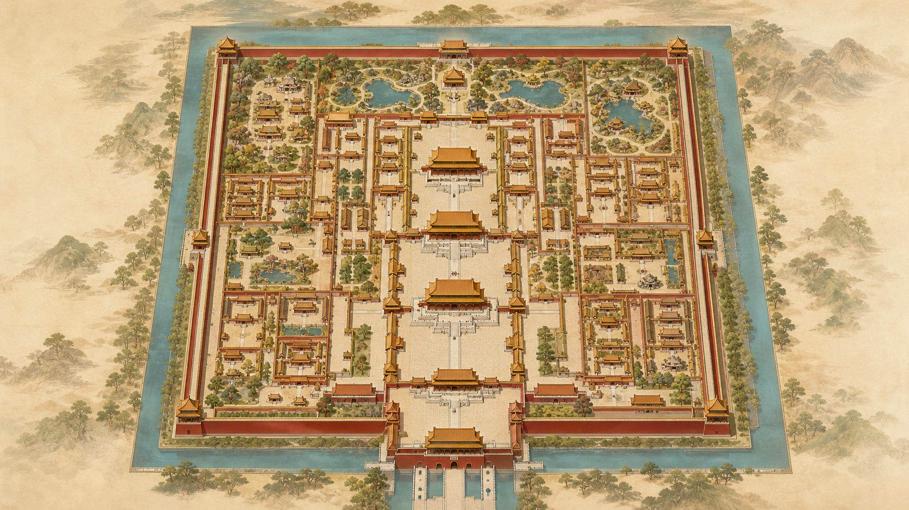
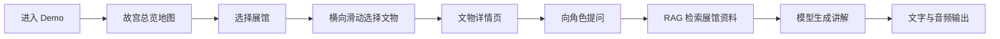
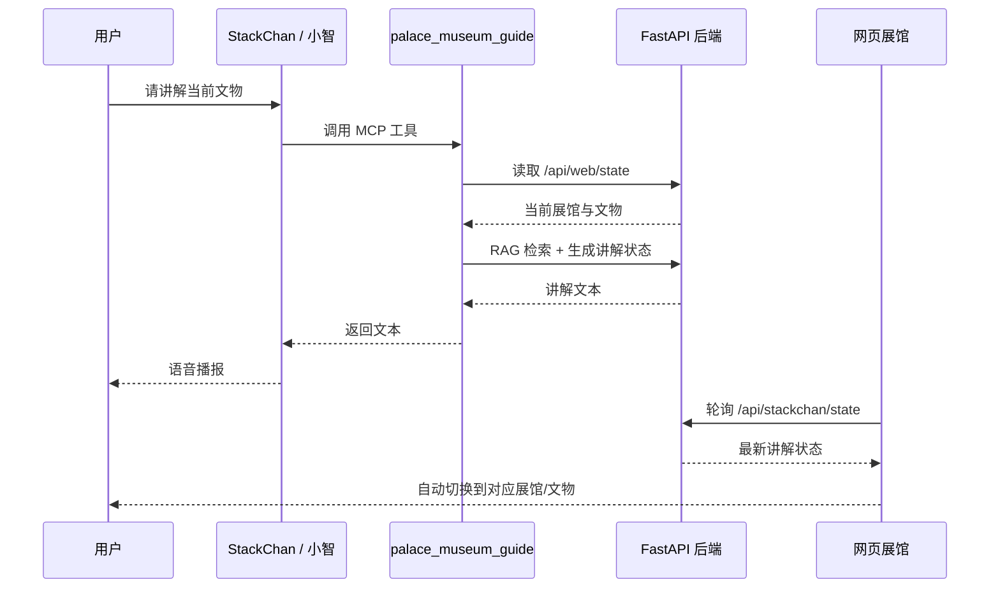
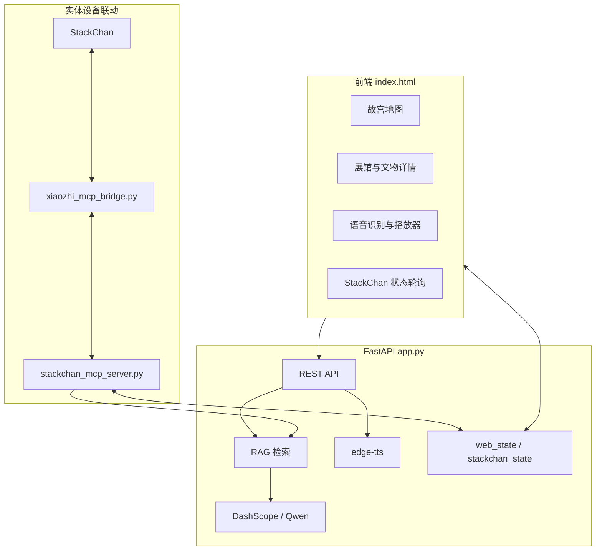

# 故宫虚拟展馆 Agent

> 一个面向文化遗产导览场景的虚拟博物馆 Agent：把故宫展馆地图、文物知识库、RAG 检索、角色化讲解、多 Agent 对话、语音讲解和 StackChan 实体设备联动整合成一个可演示的沉浸式 Demo。

<p align="center">
  <a href="https://intangible-culture-heritage-agent.onrender.com/"><strong>在线体验 Demo</strong></a>
  ·
  <a href="#核心能力">核心能力</a>
  ·
  <a href="#技术架构">技术架构</a>
  ·
  <a href="#stackchan-联动">StackChan 联动</a>
</p>

<p align="center">
  
</p>

## 项目概览

本项目从非遗/文化 Agent 原型升级为“故宫虚拟展馆”体验。用户进入网页后，可以先看到总览地图，点击不同展馆进入展馆内部，再通过横向滑动选择文物，最后进入文物详情页向对应的历史人物或讲解角色提问。

项目不仅支持网页端 AI 讲解，还接入了小智 / StackChan 的 MCP Endpoint。展示时，用户可以直接对 StackChan 说“请使用 `palace_museum_guide` 工具，讲解当前文物”，实体设备会调用后端讲解能力并说出台词；网页也会跟随 StackChan 的讲解状态自动切换展馆或文物。

## 核心能力

| 模块 | 能力 | 说明 |
| --- | --- | --- |
| 虚拟展馆 | 地图、展馆、文物详情 | 支持故宫总地图、展馆点位、文物滑动选择和详情展示 |
| RAG 讲解 | 本地知识增强 | 基于 `data/palace_museum_demo.json` 构建轻量检索，回答尽量依据展馆资料 |
| 角色系统 | 文物级人格绑定 | 不同文物绑定不同讲解角色，如御窑厂督陶官、乾隆皇帝、样式雷匠师等 |
| 多 Agent | 双人讲解与场景导演 | 两个角色分别输出观点，再整合为适合语音播放的对话 |
| 语音体验 | 浏览器语音识别 + TTS | 支持麦克风转文字和 `edge-tts` 讲解音频生成 |
| StackChan | MCP 文本讲解工具 | 只返回讲解文本，不控制舵机、灯光、表情、音量等硬件动作 |
| 状态同步 | 网页与实体设备联动 | StackChan 可触发网页切馆；网页当前文物也可被 StackChan 读取 |
| 部署 | Render 云端部署 | 支持公开访问，密钥通过环境变量配置 |

## 体验流程



## StackChan 联动流程



## 技术架构



## 主要文件

| 文件 | 作用 |
| --- | --- |
| `app.py` | FastAPI 主服务，负责 API、RAG、模型调用、音频生成、角色逻辑和状态同步 |
| `index.html` | 前端单页应用，包含地图、展馆页、文物详情、语音输入、播放器和设备同步逻辑 |
| `data/palace_museum_demo.json` | 故宫展馆与文物知识库 |
| `assets/` | 地图、展品图、文物精灵图等视觉资源 |
| `stackchan_mcp_server.py` | 安全的 StackChan MCP 文本讲解工具 |
| `xiaozhi_mcp_bridge.py` | 小智 MCP WebSocket 与本地 MCP stdio 服务桥接 |
| `render.yaml` | Render 部署配置 |
| `sw.js` / `manifest.json` | PWA 与缓存策略 |

## API 速览

| 接口 | 用途 |
| --- | --- |
| `GET /api/palace` | 获取虚拟展馆完整数据 |
| `POST /api/palace/chat` | 单人角色讲解 / 问答 |
| `POST /api/palace/scene-chat` | 双人多 Agent 场景讲解 |
| `POST /api/device/chat` | 网页端设备模拟 |
| `GET /api/web/state` | 查看网页当前展馆 / 文物 |
| `POST /api/web/state` | 写入网页当前展馆 / 文物 |
| `GET /api/stackchan/state` | 查看 StackChan 最近一次讲解状态 |
| `GET /api/health` | 健康检查 |

## 本地运行

```powershell
python -m pip install -r requirements.txt
python -m uvicorn app:app --host 127.0.0.1 --port 8000
```

打开：

```text
http://127.0.0.1:8000
```

## 环境变量

本地可参考 `.env.example`：

```env
CULTURE_AGENT_DASHSCOPE_API_KEY=your_dashscope_api_key_here
DASHSCOPE_BASE_URL=https://dashscope.aliyuncs.com/compatible-mode/v1
DASHSCOPE_MODEL=qwen-plus
EDGE_TTS_VOICE=zh-CN-YunxiNeural
XIAOZHI_MCP_ENDPOINT=wss://api.xiaozhi.me/mcp/?token=replace_with_your_token
ENABLE_STACKCHAN_MCP_BRIDGE=false
```

> 不要把真实 API Key 或 MCP Token 提交到 GitHub。生产部署请在 Render 的 Environment Variables 中配置。

## StackChan 安全边界

当前 MCP 只暴露一个工具：

```text
palace_museum_guide
```

它只返回讲解文本，不注册、不调用以下能力：

- 舵机 / 动作控制
- 表情 / 灯光控制
- 音量控制
- 重启 / 网络设置
- 任何硬件级危险操作

## 展示建议

1. 提前打开在线 Demo，等待 Render 服务唤醒。
2. 确认 StackChan MCP 页面显示 `Online`，并能看到 `palace_museum_guide`。
3. 网页切到某件文物后，对 StackChan 说：

```text
请使用 palace_museum_guide 工具，讲解当前文物。
```

4. 如果要测试切馆联动，可以说：

```text
请使用 palace_museum_guide 工具，切换到陶瓷馆并讲解。
```

## 后续计划

- 为多人访问加入 `session_id` 隔离，避免多个用户共享同一个 StackChan 状态。
- 扩充更多真实故宫展馆和重点文物资料，增强 RAG 覆盖范围。
- 加入更完整的来源引用和资料可信度标注。
- 将 StackChan 讲解流程进一步包装为“展馆导览模式”和“文物问答模式”。

---

如果这个项目是一座小型数字博物馆，那么网页是展厅，RAG 是资料库，多 Agent 是讲解团队，而 StackChan 就是可以站在展台旁边开口说话的实体讲解员。
